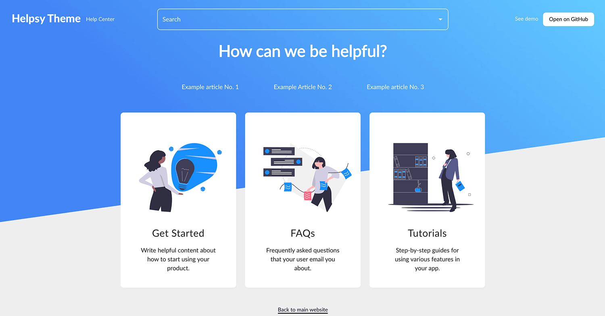

# gatsby-theme-help-center :warning: WIP

This is a Gatsby theme for creating a simple Help Center. It supports:

- **Categories** - Incl. images, titles, descriptions
- **SEO and Sharing metadata** - Rich previews, social markdup, and SEO metadata
- **MDX** - For writing the articles
- **Customization** - Logo, links, colors, and a few terms
- **Featured articles** - Shown on the home page
- **Related articles** - Which display at the bottom of other articles

## Installation

The most up-to-date docs on installing a Gatsby theme can be found [on the Gatsby website](https://www.gatsbyjs.org/docs/themes/using-a-gatsby-theme/),
but here's a summary using this theme as an example:

```bash
yarn add @mlent/gatsby-theme-help-center

# or

npm install --save @mlent/gatsby-theme-help-center
```

Then edit your `gatsby-config.js` file:

```javascript
module.exports = {
  plugins: [
    {
      resolve: '@mlent/gatsby-theme-help-center',
      options: {
        basePath: '/'
      }
    }
  ]
};
```

## Customization

### Site Metadata

You will want to customize all the site metadata:

```javascript
module.exports = {
  plugins: [
    {
      resolve: '@mlent/gatsby-theme-help-center',
      options: {
        basePath: '/'
      }
    }
  ],
  siteMetadata: {
    // Fallback title in case a title is not defined for the page
    title: 'Gatsby Help Center Theme',

    // Aside from the home page, this template will be used for all category/article pages
    titleTemplate: '%s · Gatsby Help Center Theme',

    // Meta description
    description: 'A help center theme for Gatsby.',

    // Base URL for your help center
    siteUrl: 'https://gatbsy-theme-helpsy.netlify.app',

    // Use for the og:site_name property
    siteName: 'A Help Center Theme for Gatsby',

    // Logo that appears in the top left corner
    logoUrl: '/images/logo.png',

    // Text that appears next to the logo
    logoLabel: 'Help Center',

    // Placeholder for search input field
    searchText: 'Search',

    // Your favicon 
    faviconUrl: '/images/favicon.png',

    // Image to be used when sharing articles on social media
    socialSharingImageUrl: '/images/social-sharing-default.png',

    // Your product's twitter handle
    twitter: '@monicalent',

    // Your product's Facebook page
    facebookUrl: 'https://www.facebook.com/yourpage',

    // Text/url for main call-to-action button
    ctaButtonText: 'Open on GitHub',
    ctaButtonUrl: 'https://github.com/mlent/gatsby-theme-help-center',

    // Text/url for secondary link next to call-to-action button
    linkText: 'See demo',
    linkUrl: 'https://gatbsy-theme-help-center.netlify.app/',

    // Main headline
    headline: 'How can we be helpful?',

    // Footer
    footerText: 'Back to main website',
    footerUrl: 'https://monicalent.com',

    // Google Analytics setup (Optional)
    googleTagManagerId: '',
    googleAnalyticsMeasurementId: '',
  }
}
```

> TODO: Organize components so it's easier to extend data in the `<head>` for e.g.
> site verification purposes or adding custom scripts.

### Content: Categories

Create your own YML file at `src/data/categories/data.yml` and provide as many categories
as you'd like in the following format:

```yml
- name: Get Started
  slug: getting-started
  description: Write helpful content about how to start using your product.
  image: /images/getting-started.svg
- name: FAQs
  slug: faqs
  description: Frequently asked questions that your user email you about.
  image: /images/faqs.svg
- name: Tutorials
  slug: tutorials
  description: Step-by-step guides for using various features in your app.
  image: /images/tutorials.svg
```

The illustrations from the sample site are from [Undraw](https://undraw.co/illustrations).

### Content: Articles

Create new articles by creating mdx files in `src/data/pages` and providing the following frontmatter:

```
---
title: Example Article No. 2
description: Example description that will go in the SEO description
author: Monica
categories: ["faqs"]
date: 2019-01-29
featured: true
relatedArticles: ["example-article"]
---

## What's up!

Hello fellow kids, this is another article.
```

> Note: The Author field is currently not used in the layout but may be in the future.

You may associate articles with more than one category and it will appear in both sections.

## Troubleshooting

## Issues
